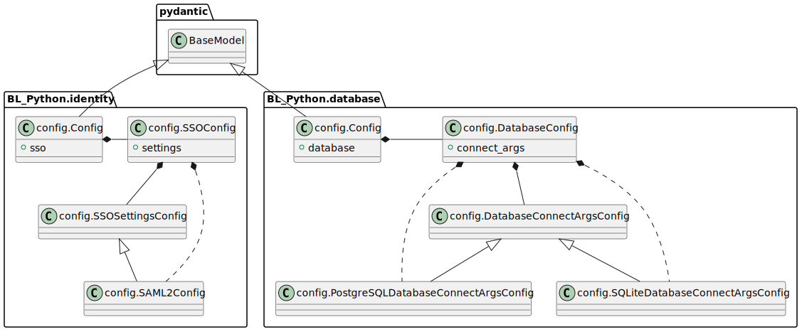

# BL_Python Config System

How the configuration system within BL_Python works.

BL_Python makes use of Pydantic and a "config builder" to provide type-safe classes with dynamic properties, and a TOML file loader.

## Why

It is common to use strings, dictionaries, tuples, and so on to contain configuration information. This is potentially dangerous, and tends to make code harder to follow or validate. A solution to this is to use classes with named attributes or properties, however, this has limitations such as a lack of validation when assigning values to these attributes. It may also prove tedious to apply configuration _files_ to the attributes, especially when the configuration files may contain information for configurations across many projects, such as in BL_Python.

For example, `BL_Python.web` contains configuration classes pertaining to web applications at [BL_Python/src/web/BL_Python/web/config.py](../../web/BL_Python/web/config.py), while `BL_Python.database` contains configuration classes pertaining to database connectivity at [BL_Python/src/database/BL_Python/database/config.py](../../database/BL_Python/database/config.py). These are two separate libraries, so they must remain independent. At the same time, applications using these libraries need a way to combine these classes and assign values from a single configuration file.

## How


### Config System Structure

To address how the system works, we need to consider its architecture and expectations.


Libraries that contain their own configuration must contain a class named `Config` that inherits from both `pydantic.BaseModel`. `BaseModel` provides data validation; Each "base" `Config` class may contain additional fields that are also `BaseModel` classes.


Both "base" configuration and non-base configuration classes can contain attributes whose values are other configuration classes. Here we see deeper navigations of configuration classes that each have their own attributes.

Make special note of the dotted-line relationships. These represent types whose base class (not "base" config) is the class indicated by the extension arrow. These classes are used as the concrete types for the navigation property from the composed configuration class.



This concept is similar to interfaces in OOP, however, the types are "late bound" during runtime, and the `__init__` method of the `BaseModel` extensions decide which concrete type should be instantiated, then handles the instantiation.

For example, `SSOConfig` will instantiate `SAML2Config` if the value of its `protocol` attribute is `SAML2`. The instance of `SAML2Config` is then assigned to its `settings` attribute.

### Config System Behavior

Because all of these classes inherit from `pydantic.BaseModel`, they are able to be used directly and in the same way that any other Pydantic models are used.

The real power of the `BL_Python` configuration system comes from its ability to combine these disparate configuration classes to create a new configuration type, as well as its ability to automatically load TOML data into the models.

#### Basic Usage

A configuration model can be instantiated from TOML data. Here is one way to create an instance of the `BL_Python.web.config.LoggingConfig` class.

```python
from BL_Python.programming.config import load_config
from BL_Python.web.config import LoggingConfig
from pprint import pprint

toml_file_path = "config.toml"
with open(toml_file_path, "w") as f:
        f.write("""\
log_level="DEBUG"
format="plaintext"
""")

logging_config = load_config(config_type=LoggingConfig, toml_file_path=toml_file_path)

pprint(logging_config)
```

This prints `LoggingConfig(log_level='DEBUG', format='plaintext')`

---

Here is a more complex example with a configuration class that has attributes that are also configuration classes. Notice that the usage is the same - only the TOML content and the `config_type` parameter are changed.

```python
from BL_Python.programming.config import load_config
from BL_Python.web.config import Config
from pprint import pprint

toml_file_path = "config.toml"
with open(toml_file_path, "w") as f:
        f.write("""\
[flask]
app_name="test_app"
host="127.0.0.1"
port="5050"

[flask.openapi]
spec_path="test_app/openapi.yaml"
validate_responses=true

[logging]
log_level="WARN"
""")

config = load_config(config_type=Config, toml_file_path=toml_file_path)

pprint(config)
```

This outputs `Config(logging=LoggingConfig(log_level='WARN', format='JSON'), web=WebConfig(security=WebSecurityConfig(cors=WebSecurityCorsConfig(origins=None, allow_credentials=False, allow_methods=['GET', 'POST', 'OPTIONS'], allow_headers=['*']), csp=None)), flask=FlaskConfig(app_name='test_app', env='Development', host='127.0.0.1', port='5050', openapi=FlaskOpenApiConfig(spec_path='test_app/openapi.yaml', validate_responses=True, use_swagger=True, swagger_url=None), session=None))`

#### `ConfigBuilder` Usage

The Basic Usage works fine when we're using a single configuration class, but what happens if we need to include configuration data that is not in the `config_type` type that was passed to `load_config`?

Here's an example that attempts to load "database" configuration data.

```python
from BL_Python.programming.config import load_config
from BL_Python.web.config import LoggingConfig
from pprint import pprint

toml_file_path = "config.toml"
with open(toml_file_path, "w") as f:
        f.write("""\
[database]
connection_string="sqlite:///:memory:"
""")

logging_config = load_config(config_type=LoggingConfig, toml_file_path=toml_file_path)

pprint(logging_config)
```

This outputs `LoggingConfig(log_level='INFO', format='JSON')`, which is not what is desired - the database information is missing! Note that this will occur with _any_ configuration class that is used for the `config_type` parameter if that class does not contain the attributes defined in the TOML file.

For this, we need to use `BL_Python.programming.config.ConfigBuilder`, which creates a new type from a set of configuration classes.

Here's an example showing how `BL_Python.database.config.DatabaseConfig` is used with `BL_Python.web.config.Config` to load TOML data for these two types.

```python
from pprint import pprint

from BL_Python.database.config import DatabaseConfig
from BL_Python.programming.config import ConfigBuilder, load_config
from BL_Python.web.config import Config

toml_file_path = "config.toml"
with open(toml_file_path, "w") as f:
    f.write("""\
[database]
connection_string="sqlite:///:memory:"
[flask]
app_name="test_app"
""")

generated_config_type = (
    ConfigBuilder[Config]()
    .with_root_config(Config)
    .with_configs([DatabaseConfig])
    .build()
)

config = load_config(config_type=generated_config_type, toml_file_path=toml_file_path)

pprint(config)
```

This prints the following. For brevity, everything except the resulting `Config` and `DatabaseConfig` attributes are elided.
```python
GeneratedConfig(
    logging=LoggingConfig(...),
    web=WebConfig(
        security=WebSecurityConfig(
            cors=WebSecurityCorsConfig(...)
        )
    ),
    flask=FlaskConfig(app_name='test_app', ...),
    database=DatabaseConfig(
        connection_string='sqlite:///:memory:',
        sqlalchemy_echo=False,
        connect_args=SQLiteDatabaseConnectArgsConfig()
    )
)
```
